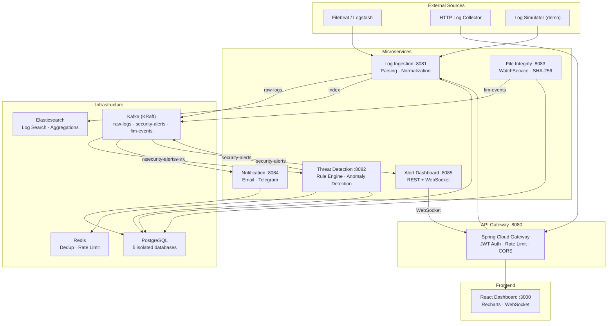

# WatchTower — Architecture Documentation

## AI-Powered Cybersecurity Threat Detection Platform

> A microservices-based security monitoring system demonstrating event-driven architecture,
> real-time data processing, and applied security engineering.

---

## System Architecture



## Data Flow

```
Raw Log → Ingestion Service → [Parse + Normalize] → Kafka(raw-logs) → Threat Detection
                                     ↓                                        ↓
                              Elasticsearch                            Rule Engine + Stats
                            (forensic search)                                ↓
                                                                    Redis (dedup check)
                                                                          ↓
                                                                   Kafka(security-alerts)
                                                                    ↓              ↓
                                                             Notification    Dashboard → WebSocket → React
```

## Kafka Partition Strategy

| Topic | Partitions | Key | Rationale |
|-------|-----------|-----|-----------|
| `raw-logs` | 6 | `source_ip` | Per-IP ordering for threshold rules |
| `security-alerts` | 3 | `alertType:severity` | Groups similar alerts |
| `fim-events` | 3 | `monitored_directory` | Per-directory ordering |

## Database Isolation

Each service owns its database — no shared-DB anti-pattern:
- `gateway_db` — Users, API keys, refresh tokens
- `ingestion_db` — Source configs, ingestion stats
- `detection_db` — Rules, detection history, ML metadata
- `fim_db` — File baselines, monitored directories
- `notification_db` — Notification history, channel configs

## Detection Engine

### Rule-Based (Configurable via REST API)
- **THRESHOLD**: Event count in sliding window (Redis counters)
- **PATTERN**: Regex matching on log fields
- **GEO_ANOMALY**: Impossible travel detection
- **SEQUENCE**: Ordered event chain (planned)

### Statistical Anomaly Detection
- Login frequency z-score analysis (mean + 3σ)
- Time-of-day deviation detection
- Redis sliding windows for per-IP counters

### ML Extension Point (Stretch Goal)
- `AnomalyDetector` Strategy interface
- Statistical detector ships by default
- Python sidecar (FastAPI + IsolationForest) behind feature flag + circuit breaker

## Tech Stack

| Layer | Technology |
|-------|-----------|
| Language | Java 21 (virtual threads, records) |
| Framework | Spring Boot 3.3, Spring Cloud Gateway |
| Messaging | Apache Kafka (KRaft mode) |
| Database | PostgreSQL 16 |
| Cache | Redis 7 |
| Search | Elasticsearch 8.13 |
| Frontend | React 18, Recharts, STOMP.js |
| Containers | Docker, docker-compose |
| Auth | JWT (HS256), BCrypt |
| Metrics | Micrometer + Prometheus endpoint |

## Running Locally

```bash
# 1. Build all services
mvn clean package -DskipTests

# 2. Start infrastructure + services
docker-compose up -d

# 3. Start log simulator (generates demo events)
cd services/log-ingestion-service
mvn spring-boot:run -Dspring-boot.run.profiles=simulator

# 4. Open dashboard
open http://localhost:3000
# Login: admin / admin123
```
