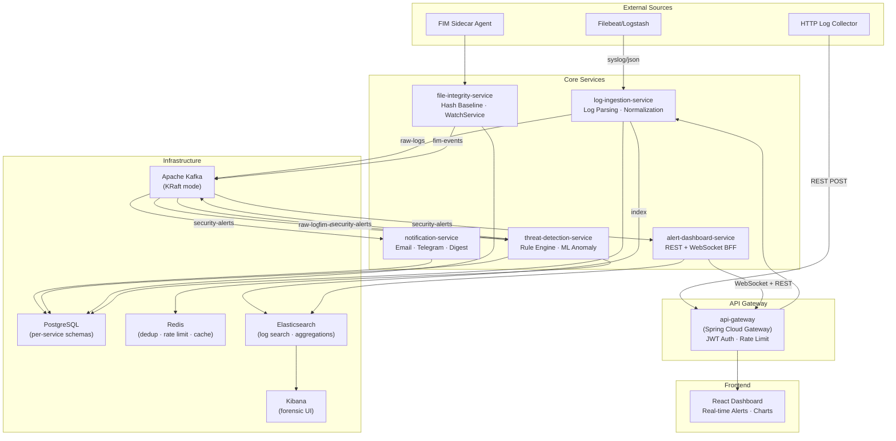
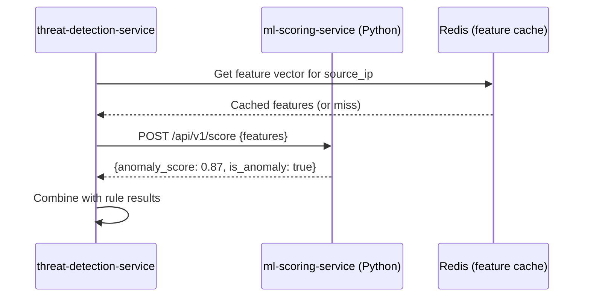
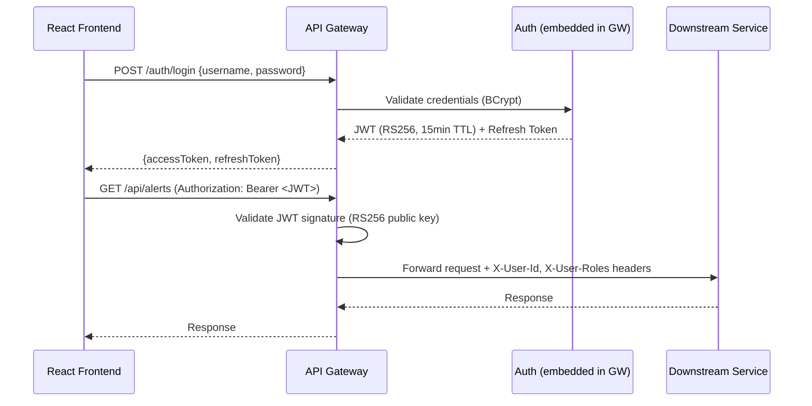

# WatchTower — AI-Powered Cybersecurity Threat Detection Platform

## Architecture Review & Implementation Plan

---

## 1. High-Level Architecture



---

## 2. Service Responsibility Breakdown

### 2.1 `api-gateway` — Spring Cloud Gateway

| Aspect | Detail |
|--------|--------|
| **Role** | Single entry point for all external traffic |
| **Auth** | JWT validation (RS256), token introspection |
| **Rate Limiting** | Redis-backed `RequestRateLimiter` filter (per-user, per-IP) |
| **Routing** | Path-based routing to downstream services |
| **CORS** | Configured for React frontend origin |
| **Health** | Actuator `/health` aggregating downstream service health |

### 2.2 `log-ingestion-service`

| Aspect | Detail |
|--------|--------|
| **Ingest** | HTTP REST endpoint (POST `/api/v1/logs/ingest`) + TCP syslog listener (port 5514) |
| **Parsing** | Strategy pattern: `SyslogParser`, `AuthLogParser`, `NginxParser`, `WindowsEventParser` |
| **Normalization** | All logs → `NormalizedLogEvent` record (timestamp, source_ip, source_host, event_type, severity, raw_message, metadata map) |
| **Kafka** | Publishes to `raw-logs` topic |
| **Elasticsearch** | Async bulk-index raw + normalized logs for forensic search |
| **DB** | Own schema `ingestion_db`: ingestion stats, parser configs, source registrations |

### 2.3 `threat-detection-service`

| Aspect | Detail |
|--------|--------|
| **Kafka Consumer** | Consumes from `raw-logs` and `fim-events` topics |
| **Rule Engine** | Configurable rules stored in Postgres (`detection_db`). Rule types: threshold (N events in T window), pattern (regex on fields), sequence (ordered event chain), geolocation (impossible travel) |
| **ML Layer** | Anomaly detection via statistical baselining + Isolation Forest (see §5) |
| **Alert Generation** | On match → publishes `SecurityAlert` to `security-alerts` topic |
| **Dedup** | Redis SET with TTL: key = `alert:{type}:{source_ip}`, TTL = 5 min. Skip if key exists |
| **DB** | Own schema `detection_db`: rules, detection history, ML model metadata |

### 2.4 `file-integrity-service`

| Aspect | Detail |
|--------|--------|
| **Monitoring** | Java `WatchService` on configured directories |
| **Baseline** | SHA-256 hashes stored in Postgres (`fim_db`) on initial scan |
| **Events** | On CREATE/MODIFY/DELETE → compute new hash, compare, publish `FileIntegrityEvent` to `fim-events` |
| **Permission Tracking** | `java.nio.file.attribute` checks on each event |
| **DB** | Own schema `fim_db`: file_baselines, monitored_directories, change_history |

### 2.5 `notification-service`

| Aspect | Detail |
|--------|--------|
| **Kafka Consumer** | Consumes from `security-alerts` |
| **Routing** | Severity-based: CRITICAL → immediate email+Telegram, HIGH → immediate email, MEDIUM → hourly digest, LOW → daily digest |
| **Email** | Spring Mail with SMTP (configurable provider) |
| **Telegram** | Telegram Bot API via `RestClient` |
| **Digest** | Scheduled `@Scheduled` job batches low-priority alerts |
| **DB** | Own schema `notification_db`: notification_history, channel_configs, subscription_preferences |

### 2.6 `alert-dashboard-service` (BFF)

| Aspect | Detail |
|--------|--------|
| **REST API** | Aggregation endpoints: alerts by severity, by time window, by source IP, top-N |
| **WebSocket** | STOMP over WebSocket — pushes live `SecurityAlert` events to connected React clients |
| **Kafka Consumer** | Consumes `security-alerts` → fans out to WebSocket sessions |
| **Elasticsearch** | Queries ES for aggregations (date histograms, terms aggs) and log drill-down |
| **Streaming** | WebFlux SSE endpoint as fallback for WebSocket |

---

## 3. Kafka Topic Topology & Partition Strategy

### Topics

| Topic | Partitions | Retention | Key | Rationale |
|-------|-----------|-----------|-----|-----------|
| `raw-logs` | 6 | 7 days | `source_ip` | Ensures all logs from the same IP land in the same partition → ordering guarantees for per-IP rule evaluation (e.g., failed login counting). 6 partitions allows scaling consumers up to 6 instances. |
| `security-alerts` | 3 | 30 days | `alert_type + severity` | Groups similar alerts together. Fewer partitions since alert volume is lower than raw logs. Longer retention for audit trail. |
| `fim-events` | 3 | 14 days | `monitored_directory` | Groups events by watched directory for ordered processing per directory. |

### Consumer Groups

| Group ID | Topic | Service |
|----------|-------|---------|
| `threat-detection-group` | `raw-logs`, `fim-events` | threat-detection-service |
| `notification-group` | `security-alerts` | notification-service |
| `dashboard-group` | `security-alerts` | alert-dashboard-service |

> [!IMPORTANT]
> **Partition key choice matters.** Using `source_ip` for `raw-logs` is deliberate: threshold-based rules (e.g., "5 failed logins in 60s from same IP") require ordered, co-located events per IP. Without this, you'd need distributed counting (e.g., Kafka Streams with KTables), which adds complexity for a portfolio project.

---

## 4. Data Models (Key Entities)

### NormalizedLogEvent (shared DTO — published to Kafka)

```java
public record NormalizedLogEvent(
    String eventId,          // UUID
    Instant timestamp,
    String sourceIp,
    String sourceHost,
    String eventType,        // AUTH_FAILURE, HTTP_REQUEST, FILE_ACCESS, etc.
    Severity severity,       // INFO, WARNING, ERROR, CRITICAL
    String rawMessage,
    Map<String, String> metadata  // flexible key-value pairs
) {}
```

### DetectionRule (Postgres entity in detection_db)

```java
@Entity
@Table(name = "detection_rules", schema = "detection_db")
public class DetectionRule {
    @Id @GeneratedValue
    private Long id;
    private String name;
    private String description;
    
    @Enumerated(EnumType.STRING)
    private RuleType type;           // THRESHOLD, PATTERN, SEQUENCE, GEO_ANOMALY
    
    @Enumerated(EnumType.STRING)
    private Severity severity;
    
    @JdbcTypeCode(SqlTypes.JSON)
    private RuleConfig config;       // JSON: {threshold, window, pattern, etc.}
    
    private boolean enabled;
    private Instant createdAt;
    private Instant updatedAt;
}
```

### SecurityAlert (published to Kafka)

```java
public record SecurityAlert(
    String alertId,
    Instant timestamp,
    String alertType,
    Severity severity,
    String sourceIp,
    String description,
    String matchedRuleId,       // null if ML-detected
    String mlModelId,           // null if rule-detected
    double confidenceScore,     // 0.0-1.0
    NormalizedLogEvent triggeringEvent,
    Map<String, String> context
) {}
```

### FileBaseline (Postgres entity in fim_db)

```java
@Entity
@Table(name = "file_baselines", schema = "fim_db")
public class FileBaseline {
    @Id @GeneratedValue
    private Long id;
    private String filePath;
    private String sha256Hash;
    private String permissions;
    private String owner;
    private long fileSize;
    private Instant lastScanned;
    private Instant createdAt;
}
```

---

## 5. ML Component — Honest Assessment

> [!NOTE]
> **My recommendation: Start with statistical baselining in Java, with a clear interface that allows plugging in a Python ML sidecar later.**

### Approach: Two-Phase

#### Phase 1 — Statistical Baselining (ship this)

Implement directly in Java within `threat-detection-service`:

- **Login frequency anomaly**: Maintain per-user sliding window stats (mean, stddev of logins/hour). Flag if current rate > mean + 3σ.
- **Time-of-day anomaly**: Build a histogram of login hours per user. Flag logins outside the user's normal 95th percentile window.
- **Geo-velocity (impossible travel)**: If two logins from IPs in different geolocations occur within a time window shorter than physically possible travel time, flag it. Use a free GeoIP database (MaxMind GeoLite2).

This is **genuinely useful**, easy to explain in interviews, and doesn't require ML infrastructure.

#### Phase 2 — Isolation Forest via Python Sidecar (stretch goal)



- Python FastAPI service with scikit-learn `IsolationForest`
- Feature vector: login_count_1h, login_count_24h, unique_ips_24h, hour_of_day, geo_distance_from_usual
- Train on historical "normal" data; score new events
- **Why Python sidecar over Java ML lib?** scikit-learn's IsolationForest is battle-tested. Java options (Smile, Tribuo) work but have less community support for anomaly detection. For a portfolio, showing polyglot microservices is actually a positive signal.

> [!TIP]
> **Interview talking point:** "We used a Strategy pattern with an `AnomalyDetector` interface. The statistical detector ships by default. The ML sidecar is behind a feature flag and circuit breaker (Resilience4j). If the ML service is down, we gracefully degrade to statistical-only detection."

---

## 6. Security Architecture

### Authentication Flow



### Service-to-Service Security

- **JWT propagation**: Gateway validates and forwards user context via headers
- **Internal services**: Not exposed externally; Docker network isolation
- **Kafka**: SASL/PLAIN auth in production (document as config, use plaintext for local dev)
- **Postgres**: Per-service credentials, least-privilege roles

---

## 7. Docker Compose Topology

```
docker-compose.yml
├── postgres          (port 5432, 5 databases initialized via init script)
├── kafka             (KRaft mode, no Zookeeper, port 9092)
├── redis             (port 6379)
├── elasticsearch     (port 9200)
├── kibana            (port 5601)
├── api-gateway       (port 8080 — only externally exposed service port)
├── log-ingestion-service    (port 8081, internal)
├── threat-detection-service (port 8082, internal)
├── file-integrity-service   (port 8083, internal)
├── notification-service     (port 8084, internal)
├── alert-dashboard-service  (port 8085, internal)
├── ml-scoring-service       (port 8090, internal, Python — stretch goal)
└── react-frontend           (port 3000, nginx serve)
```

### Postgres Init Strategy

A single Postgres container with an init script that creates 5 databases:

```sql
CREATE DATABASE ingestion_db;
CREATE DATABASE detection_db;
CREATE DATABASE fim_db;
CREATE DATABASE notification_db;
CREATE DATABASE gateway_db;  -- user accounts, API keys
```

Each service connects to only its own database → **no shared-DB anti-pattern**.

---

## 8. Frontend Architecture (React)

### Pages

| Page | Key Components |
|------|---------------|
| **Dashboard** | Alert trend chart (line, 24h), severity donut chart, top-10 source IPs bar chart, active alerts count cards |
| **Live Alerts** | Real-time WebSocket feed, filterable table, severity badges, auto-scroll |
| **Alert Detail** | Raw log viewer, matched rule display, ML confidence score, timeline of related events |
| **File Integrity** | Monitored directories list, baseline status, recent changes table, hash comparison |
| **Rules** | CRUD for detection rules, enable/disable toggle, test-against-sample-log |
| **Settings** | Notification preferences, Telegram setup, email config |

### Tech Choices

- **Recharts** for charts (lighter than D3 for dashboards)
- **STOMP.js** + **SockJS** for WebSocket
- **React Query (TanStack Query)** for REST data fetching + caching
- **React Router v6** for routing
- **CSS Modules or styled-components** (no Tailwind unless you prefer)

---

## 9. Scope Assessment — What to Keep vs. Cut

> [!WARNING]
> **Building all 6 services + ML + full React dashboard is approximately 3-4 weeks of focused full-time work for a solo developer.** Here's my prioritized breakdown:

### 🟢 MUST BUILD (Core "wow factor" for interviews)

| Component | Why |
|-----------|-----|
| `log-ingestion-service` | Demonstrates: Kafka producer, log parsing strategy pattern, ES indexing, virtual threads |
| `threat-detection-service` (rules + stats baselining) | **Star of the show.** Event-driven consumer, rule engine, Redis dedup, anomaly detection |
| `alert-dashboard-service` + React frontend | Real-time WebSocket, Recharts dashboard, drill-down. **Visually impressive** |
| `api-gateway` | JWT auth, rate limiting, routing — expected in any microservices project |
| `docker-compose.yml` + `ARCHITECTURE.md` | Shows systems thinking. Interviewers will read this first |

### 🟡 SHOULD BUILD (adds depth, but can be simplified)

| Component | Simplification |
|-----------|---------------|
| `notification-service` | Implement email only, Telegram as stretch. Skip digest batching initially |
| `file-integrity-service` | Keep it — it's unique and shows OS-level Java skills. Can be a lighter service |

### 🔴 DEFER (stretch goals, mention in README)

| Component | Why defer |
|-----------|----------|
| Python ML sidecar | The statistical baselining in Java is sufficient. Mention the architecture for it, show the interface, but don't ship it in v1 |
| Mutual TLS | Document as "production recommendation", use JWT propagation for now |
| Prometheus/Grafana | Add Actuator + Micrometer endpoints, but the Grafana stack is infra overhead for a demo |
| Windows Event Log parsing | Stick to syslog + auth.log + nginx. Mention Windows support in README |

### Estimated Timeline (solo developer)

| Phase | Duration | Deliverables |
|-------|----------|-------------|
| **1. Foundation** | 2-3 days | Docker Compose, shared DTOs, Kafka config, Postgres schemas, project scaffolding |
| **2. Ingestion + Detection** | 4-5 days | Log parsing, Kafka pipeline, rule engine, statistical anomaly, Redis dedup |
| **3. Dashboard + Gateway** | 3-4 days | REST APIs, WebSocket, React frontend with Recharts, JWT auth |
| **4. FIM + Notifications** | 2-3 days | WatchService, hash baseline, email notifications |
| **5. Polish** | 2-3 days | ARCHITECTURE.md diagram, README, Docker optimization, demo data seeder |
| **Total** | **~2-3 weeks** | |

---

## 10. Project Structure (Monorepo)

```
WatchTower/
├── ARCHITECTURE.md
├── README.md
├── docker-compose.yml
├── docker/
│   ├── postgres/
│   │   └── init.sql
│   ├── kafka/
│   ├── elasticsearch/
│   └── nginx/
├── common/
│   └── watchtower-common/         ← Shared DTOs, events, enums (Maven module)
│       ├── pom.xml
│       └── src/
├── services/
│   ├── api-gateway/
│   │   ├── Dockerfile
│   │   ├── pom.xml
│   │   └── src/
│   ├── log-ingestion-service/
│   │   ├── Dockerfile
│   │   ├── pom.xml
│   │   └── src/
│   ├── threat-detection-service/
│   │   ├── Dockerfile
│   │   ├── pom.xml
│   │   └── src/
│   ├── file-integrity-service/
│   │   ├── Dockerfile
│   │   ├── pom.xml
│   │   └── src/
│   ├── notification-service/
│   │   ├── Dockerfile
│   │   ├── pom.xml
│   │   └── src/
│   └── alert-dashboard-service/
│       ├── Dockerfile
│       ├── pom.xml
│       └── src/
├── frontend/
│   ├── Dockerfile
│   ├── package.json
│   └── src/
└── pom.xml                       ← Parent POM (Maven multi-module)
```

---

## 11. Key Architectural Decisions (Interview Talking Points)

| Decision | Rationale |
|----------|-----------|
| **KRaft Kafka (no Zookeeper)** | Modern Kafka 3.x+ default, simpler Docker setup, forward-compatible |
| **Partition by `source_ip`** | Enables stateful per-IP rule evaluation without distributed state stores |
| **Redis for dedup, not Kafka dedup** | Simpler, cross-topic dedup, TTL-based expiry fits alert storm suppression perfectly |
| **Statistical baselining over deep learning** | Honest engineering: 95% of production anomaly detection starts here. Shows judgment, not hype |
| **Per-service databases** | Demonstrates understanding of microservice data ownership. No shared-DB anti-pattern |
| **WebSocket via STOMP** | Spring's first-class support, message broker semantics, easy to scale with Redis pub/sub later |
| **Virtual threads for ingestion** | Java 21 feature, perfect for high-throughput I/O-bound log processing |
| **Strategy pattern for parsers** | Extensible without modifying existing code (OCP). Easy to explain in interviews |

---

## 12. Open Questions for You

Before I start scaffolding code, I need your input on:

1. **Build tool**: Maven or Gradle? (I've assumed Maven multi-module above, but Gradle Kotlin DSL is also clean.)

2. **Auth scope**: Should the gateway include a full user registration/login flow (with Postgres-backed user table), or is a hardcoded JWT secret + pre-generated tokens sufficient for the demo?

3. **Frontend styling**: Any preference? I'll default to a sleek dark-mode design with CSS Modules unless you want something specific.

4. **Demo data**: Should I include a log simulator that generates fake syslog/auth.log events to demonstrate the pipeline end-to-end without needing real Filebeat?

5. **Repository hosting**: Will this go on GitHub? (Affects README/CI considerations.)
